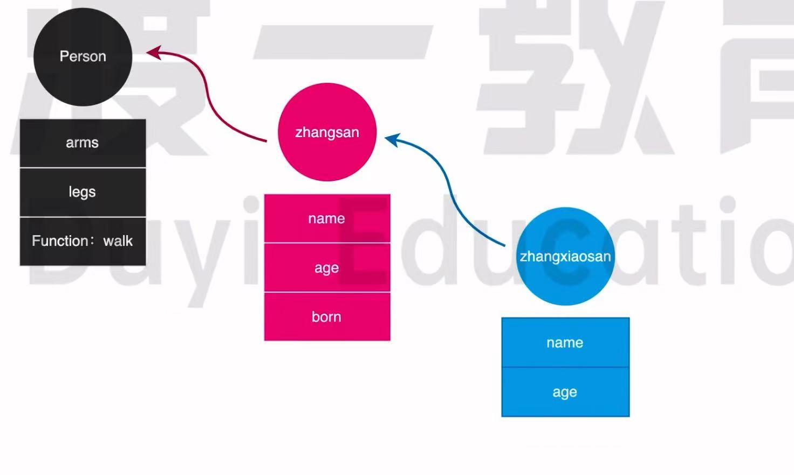
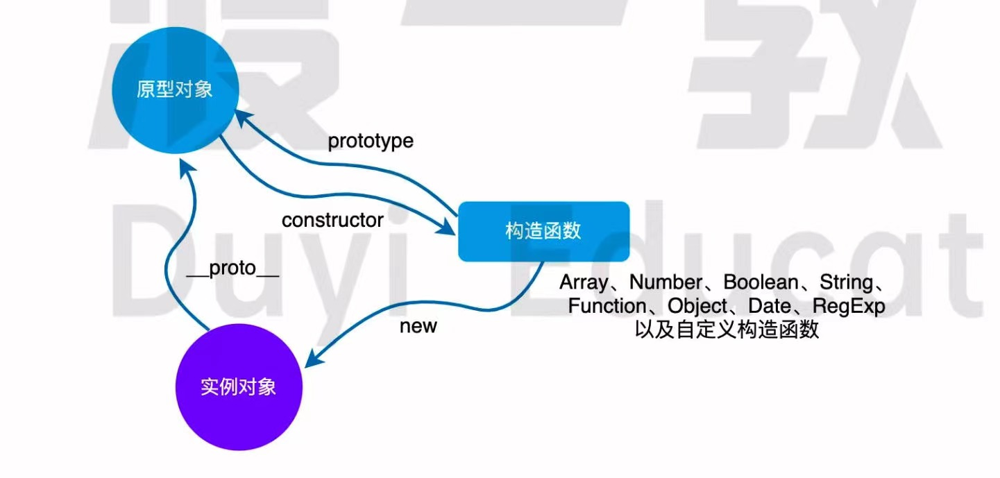
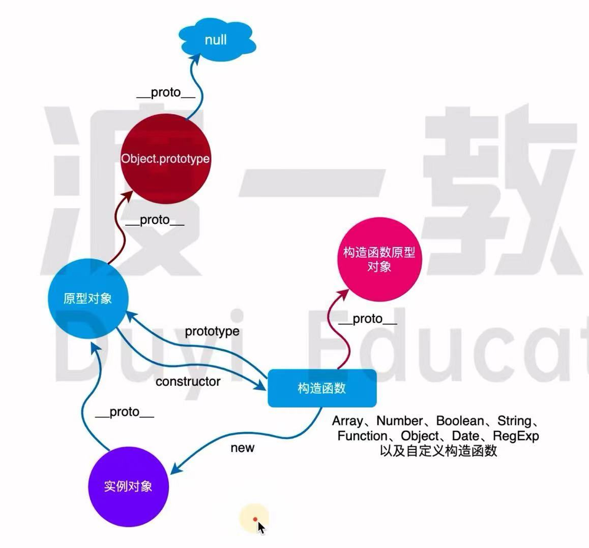
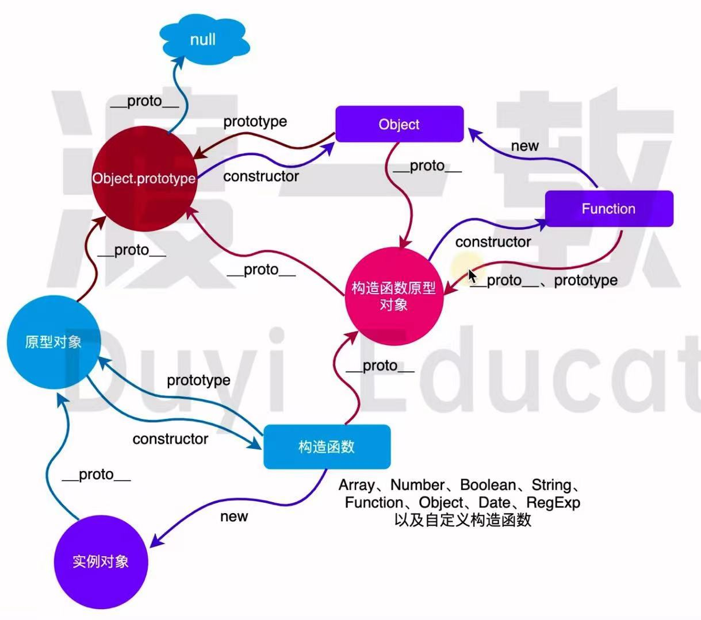

# <a id="top"> 原型和原型链 <a/>
## 思考

> [说一说你对 JavaScript 中原型与原型链的理解？（美团 2019年）](#answer)

> [对一个构造函数实例化后， 它的原型链指向什么？](#answer2)

## 原型与原型链介绍

在 Brendan Eich 设计 JavaScript 时， 借鉴了 Self 和 Smalltalk 这两门基于原型的语言。

之所以选择基于原型的面向对象系统， 是因为 Brendan Eich 一开始就没有打算在 JavaScript 中加入类的概率， 因为 JavaScript 的设计初衷就是为非专业的开发人员 （例如网页设计者） 提供一个方便的工具。 由于大部门网页设计者都没有任何的编程背景， 所以在设计 JavaScript 是也是尽可能使其简单、易学。

这因为如此， JavaScript 中的原型以及原型链成为了这门语言最大的特点， 在面试的时候， 面试官也经常会围绕原型和原型链展开提问。

JavaScript 是一门基于原型的语言， 对象的产生是通过原型对象而来的。

ES5 中提供了 Object.create 方法， 可以用来克隆对象。

示例如下：

```js
const person = {
    arms: 2,
    legs: 2,
    walk() {
        console.log('walking');
    }
}
const zhangsan = Object.create(person);
console.log(zhangsan.arms); // 2
console.log(zhangsan.legs); // 2
zhangsan.walk(); // walking
console.log(zhangsan.__proto__ === parent); // true
```

在上面的示例中， 我们通过 `Object.create` 方法来对 `person` 对象进行克隆， 克隆出来一个名为 `zhangsan` 的对象， 所以 `person` 对象就是 `zhangsan` 这个对象的原型对象

person 对象上面的属性和方法， 张三这个对象上面都有。

通过 __proto__ 属性， 我们可以访问到一个对象的原型对象。

[index.js 示例](index.js) 该例中， zhangsan 这个对象是从 person 这个对象克隆而来的， 而 `zhangxiaosan` 这个对象又是从 `zhangsan` 对象克隆而来， 以此形成了一条原型链。 无论是 `person` 对象， 还是 `zhangsan` 对象上面的属性和方法 `zhangxiaosan` 这个对象都能继承到

来看下面的图：



这就是 JavaScript 中最原始的创建对象的方式， 一个对象是通过克隆另外一个对象所得到的。 就像克隆羊朵莉一样， 通过克隆可以创造一个一模一样的对象， 被克隆的对象是新对象的原型对象。

[index.js 示例](index.js) 该例中 我们 `new` 了两次， 所以生产了两个对象， 我们把这两个对象分别存储到 `apple` 和 `huawei` 这两个变量里面。

有一个非常有意思的现象， 就是我们在书写 `Computer` 构造函数的实力方法的时候， 并没有将这个方法书写在构造函数里面， 而是写在了 `Computer.prototype` 上面， 那么这个 `Computer.prototype` 是啥呢？

这个 Computer.prototype 实际上就是 Computer 实例对象的原型对象。 要搞清楚这个， 看下面的图：



这是最重要的一个三角关系

通过上图，总结以下的结论：

- JavaScript 中每个对象都有一个原型对象。 可以通过 __proto__ 属性来访问到对象的原型对象。
- 构造函数的 prototype 属性指向一个对象， 这个对象是构造函数实例化的对象的原型对象。
- 原型对象的 constructor 属性也指向其构成函数。
- 实例对象的 constructor 是从它的原型对象上访问到的。

```js
// 内置的构造函数也有这样的三角关系
const arr = [];

// new Array();
console.log(Array.prototype === arr.__proto__) // true

console.log(Array.__proto__ === Computer.__proto__) // true
console.log(Date.__proto__ === Computer.__proto__) // true
console.log(Number.__proto__ === Computer.__proto__) // true
console.log(Function.__proto__ === Computer.__proto__) // true
console.log(Object.__proto__ === Computer.__proto__) // true
console.log(Computer.__proto__) // {}
```

通过上面的代码， 我们发现所有的构造函数， 无论是自定义的还是内部的， 它们的原型对象都是同一个对象。

以上知识能够掌握整个原型和原型链的大部分内容

继续深究，上面的图可以拓展成这样： 




在 `JavaScript` 中，每个对象， 都有一个原型对象。 而原型对象上面也有一个自己的原型对象， 一层一层向上找， 最终会到达 `null` .

```js
function Computer(name, price) {
    this.name = name;
    this.price = price;
}
Computer.prototype.showPrice = function () {
    console.log(`${this.name}的电脑价格为${this.price}`);
}

const apple = new Computer('苹果', 15000);

console.log(apple.__proto__.__proto__); // [Object: null prototype] {}
console.log(apple.__proto__.__proto__.__proto__); // null
console.log(apple.__proto__.__proto__ === Object.prototype); // true
console.log(Object.prototype.__proto__ ); // null
```

可以看到，在上面的代码中， 我们顺着原型链一层一层往上找， 最终到达了 null


      

```js
// Object.prototype 在往上一层 （__proto__） 就是 null
console.log(Object.prototype.constructor); // [Function: Object]

console.log(Computer.__proto__ === Object.prototype.constructor.__proto__); // true

console.log(Object.prototype.constructor.__proto__.constructor) // [Function: Function]
console.log(Object.prototype.constructor.__proto__.constructor.__proto__) // {}
console.log(Object.prototype.constructor.__proto__.constructor.prototype) // {}
console.log(Object.prototype.constructor.__proto__.constructor.__proto__ === Object.prototype.constructor.__proto__.constructor.prototype) // true
```

> <a id="answer">说一说你对 JavaScript 中原型与原型链的理解？（美团 2019年）</a>
> 
> 参考答案
> - 每个对象都有一个 __proto__ 属性， 该属性指向自己的原型对象
> - 每个构造函数都有一个 prototype 属性， 该属性指向实力对象的原型对象
> - 原型对象里的 constructor 指向构造函数本身
> 
> 如下图
>
> 
> 
> 每个对象都有自己的原型对象，而原型对象本身，也有自己原型对象， 从而形成一条原型链条、
> 
> 当试图访问一个对象的属性时， 它不仅仅在该对象上搜寻， 还会搜寻该对象的原型， 以及该对象的原型的原型， 依次层层向上搜索， 直到找到一个名字匹配的属性或达到原型链的末尾。

> <a id="answer2">对一个构造函数实例化后， 它的原型链指向什么？</a> 
> 
> 参考答案
> 
> 指向该构造函数的实例化出来对象的原型对象
> 
> 对于构造函数来讲， 可以通过 prototype 访问到该对象
> 
> 对于实例对象来讲， 可以通过隐式属性 __proto__ 来访问到。

[顶部](#top)
