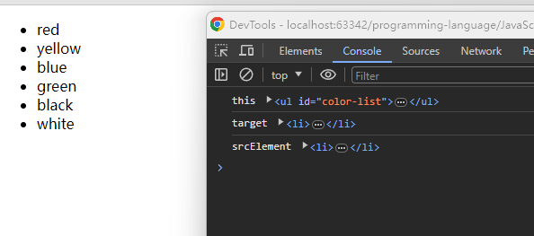

# <a id="top"> this 指向 <a/>
## 思考

> [this 的指向哪几种？](#answer)

## this 指向总结

this 关键字是一个非常重要的语法点。 毫不夸张地说， 不理解它的含义， 大部分开发任务都无法完成。

this 可以用在构造函数之中， 表示实例对象。 除此之外， this 还可以用在别的场合。 但是不管是什么场合， this 都有一个共同点： 它总是返回一个对象。

关于 this 的指向， 有一种广为流传的说法就是“谁调用它， this 就指向谁”。

这样的说法没有太大的问题， 但是并不是太全面。 总结起来， this 的指向规律有如下几条：

- 在函数体中， 非显示或隐式地简单调用函数时， 在严格模式下， 函数内的 this 会被绑定到 undefined 上， 在非严格模式下则会被绑定到全局对象 window/global 上。
- 一般使用 new 方法调用构造函数时， 构造函数内的 this 会被绑定到新创建的对象上。
- 一般通过 call/apply/bind 方法显示调用函数时， 函数体内的 this 会被绑定到指定参数的对象上。
- 一般通过上下文对象调用函数时， 函数体内的 this 会绑定到该对象上。
- 在箭头函数中， this 的指向是由外层 （函数或全局）作用域来决定的。

当然， 真实环境多种多样， 下面我们就来根据实战例题逐一梳理。

### 全局环境中的 this

例题 [index](index.js)


### 上下文对象调用中的 this 

例题 [index](index.js)

### this 指向绑定事件的元素

示例
```html
<ul id="color-list">
    <li>red</li>
    <li>yellow</li>
    <li>blue</li>
    <li>green</li>
    <li>black</li>
    <li>white</li>
</ul>
```

```js
// this 是绑定事件的元素
// target 是触发事件的元素 和 srcElement 等价

const colorList = document.getElementById('color-list');
colorList.addEventListener('click', function (event) {
    console.log('this', this);
    console.log('target', event.target);
    console.log('srcElement', event.srcElement);
})
```



有些时候我们会遇到一些困扰， 比如在 div 节点的事件函数内部， 有一个局部的 callback 方法， 该方法被作为普通函数调用时， callback 内部的 this 是指向全局对象 window 的

例如：

```html
<div id="div1">我是一个div</div>
```
```js
window.id = 'window';
document.getElementById('div1').onclick = function () {
    console.log(this.id); // div1
    const callback = function () {
        console.log(this.id); // 因为是普通函数调用， 所以 this 指向 window
    }
    callback();
}
```

此时有一种简单的解决方案， 可以用一个变量保存 div 节点的引用， 如下：

```js
window.id = 'window';
document.getElementById('div1').onclick = function () {
    console.log(this.id); // div1
    const that = this; // 保存当前 this 的指向
    const callback = function () {
        console.log(that.id); // div1
    }
    callback();
}
```

### 改变 this 指向

#### 1、call、apply、bind 方法修改 this 指向

由于 JavaScript 中 this 的指向手函数运行环境的影响， 指向经常改变， 使得开发变得困难和模糊， 所以在封装 sdk 或者写一些复杂函数的时候经常会用到 this 指向绑定， 以避免出现不必要的问题。

call、 apply、 bind 基本都能实现这一些功能， 起到确定 this 指向的作用

**Function.prototype.call()**

call 方法可以指定 this 的指向 （即行数执行是所在的作用域），然后再指定作用域中， 执行函数。

```js
// call
// A.call(B)
// A 通常是一个方法
// B 通常是一个对象
// 调用 A 方法， 但是 this 指向 B 这个对象

var obj = {};
function fn() {
    return this;
}

console.log(fn() === global); // true
console.log(fn.call(obj) === obj); // true 
```

上面代码中， 全局环境运行函数/时， this 指向全局环境 （浏览器 window 对象）;

call 方法可以改变 this 的指向， 指定 this 指向对象 obj, 然后在对象 obj 的作用域中运行函数 f.

call 方法的参数， 应该是对象 obj, 如果参数为空或 null、 undefined , 则默认传参全局对象。

```js
var n = 123;
var obj = { n: 456 };

function a() {
    console.log(this.n);
}

a.call(); // 123
a.call(null); // 123
a.call(undefined); // 123
a.call(window); // 123
a.call(obj); // 456

```
上面代码中， a 函数中 this 关键字， 如果指向全局对象， 返回结果为 123.

如果使用 call 方法将 this 关键字指向 obj 对象， 返回结果为 456. 可以看到， 如果 call 方法没有参数， 或者参数为 null 或 undefined， 则等同于指向全局对象。

如果 call 传参不是以上类型， 则转化成对应的包装对象， 然后传入方法。

例如， 5 转成 Number 实例， 绑定 f 内部 this

```js
var f = function () {
    return this;
}
console.log(f.call(5)) // [Number: 5]
```

call 可以接受多个参数， 第一个参数是 this 指向的对象， 之后的是函数回掉所需的参数。

```js
function add(a, b) {
    return a + b;
}

console.log(add.call(null, 1, 2)); // 3
```
call 方法的一个应用是调用对象的原生方法。
```js
var obj = {};

console.log(obj.hasOwnProperty('toString')); // false
console.log(obj.toString()); // [object Object]

// 通过上面的例子， 我们可以知道
// obj 能够调用 toString, 但是 toString 这个方法并不是他自身所拥有的
// 来自它的原型对象上面

obj.hasOwnProperty = function () {
    return 'aaa';
}
console.log(obj.hasOwnProperty('toString')); // aaa

// 上面我们对 hasOwnProperty 这个方法进行了覆盖
// 使用 call 可以调用原生的方法
console.log(Object.prototype.hasOwnProperty.call(obj, 'toString'));  // false
```


> <a id="answer">this 的指向哪几种？</a>
>  
> 


[顶部](#top)
