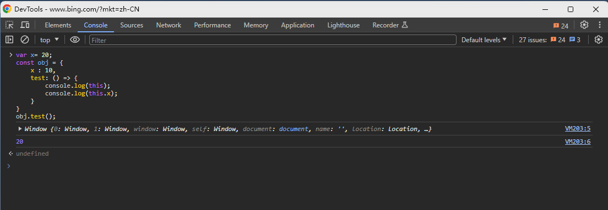

# <a id="top"> this 指向 <a/>
## 思考

> [this 的指向哪几种？](#answer)

## this 指向总结

this 关键字是一个非常重要的语法点。 毫不夸张地说， 不理解它的含义， 大部分开发任务都无法完成。

this 可以用在构造函数之中， 表示实例对象。 除此之外， this 还可以用在别的场合。 但是不管是什么场合， this 都有一个共同点： 它总是返回一个对象。

关于 this 的指向， 有一种广为流传的说法就是“谁调用它， this 就指向谁”。

这样的说法没有太大的问题， 但是并不是太全面。 总结起来， this 的指向规律有如下几条：

- 在函数体中， 非显示或隐式地简单调用函数时， 在严格模式下， 函数内的 this 会被绑定到 undefined 上， 在非严格模式下则会被绑定到全局对象 window/global 上。
- 一般使用 new 方法调用构造函数时， 构造函数内的 this 会被绑定到新创建的对象上。
- 一般通过 call/apply/bind 方法显示调用函数时， 函数体内的 this 会被绑定到指定参数的对象上。
- 一般通过上下文对象调用函数时， 函数体内的 this 会绑定到该对象上。
- 在箭头函数中， this 的指向是由外层 （函数或全局）作用域来决定的。

当然， 真实环境多种多样， 下面我们就来根据实战例题逐一梳理。

### 全局环境中的 this

例题 [index](index.js)


### 上下文对象调用中的 this 

例题 [index](index.js)

### this 指向绑定事件的元素

示例
```html
<ul id="color-list">
    <li>red</li>
    <li>yellow</li>
    <li>blue</li>
    <li>green</li>
    <li>black</li>
    <li>white</li>
</ul>
```

```js
// this 是绑定事件的元素
// target 是触发事件的元素 和 srcElement 等价

const colorList = document.getElementById('color-list');
colorList.addEventListener('click', function (event) {
    console.log('this', this);
    console.log('target', event.target);
    console.log('srcElement', event.srcElement);
})
```


有些时候我们会遇到一些困扰， 比如在 div 节点的事件函数内部， 有一个局部的 callback 方法， 该方法被作为普通函数调用时， callback 内部的 this 是指向全局对象 window 的

例如：

```html
<div id="div1">我是一个div</div>
```
```js
window.id = 'window';
document.getElementById('div1').onclick = function () {
    console.log(this.id); // div1
    const callback = function () {
        console.log(this.id); // 因为是普通函数调用， 所以 this 指向 window
    }
    callback();
}
```

此时有一种简单的解决方案， 可以用一个变量保存 div 节点的引用， 如下：

```js
window.id = 'window';
document.getElementById('div1').onclick = function () {
    console.log(this.id); // div1
    const that = this; // 保存当前 this 的指向
    const callback = function () {
        console.log(that.id); // div1
    }
    callback();
}
```

### 改变 this 指向

#### 1、call、apply、bind 方法修改 this 指向

由于 JavaScript 中 this 的指向手函数运行环境的影响， 指向经常改变， 使得开发变得困难和模糊， 所以在封装 sdk 或者写一些复杂函数的时候经常会用到 this 指向绑定， 以避免出现不必要的问题。

call、 apply、 bind 基本都能实现这一些功能， 起到确定 this 指向的作用

**Function.prototype.call()**

call 方法可以指定 this 的指向 （即行数执行是所在的作用域），然后再指定作用域中， 执行函数。

```js
// call
// A.call(B)
// A 通常是一个方法
// B 通常是一个对象
// 调用 A 方法， 但是 this 指向 B 这个对象

var obj = {};
function fn() {
    return this;
}

console.log(fn() === global); // true
console.log(fn.call(obj) === obj); // true 
```

上面代码中， 全局环境运行函数/时， this 指向全局环境 （浏览器 window 对象）;

call 方法可以改变 this 的指向， 指定 this 指向对象 obj, 然后在对象 obj 的作用域中运行函数 f.

call 方法的参数， 应该是对象 obj, 如果参数为空或 null、 undefined , 则默认传参全局对象。

```js
var n = 123;
var obj = { n: 456 };

function a() {
    console.log(this.n);
}

a.call(); // 123
a.call(null); // 123
a.call(undefined); // 123
a.call(window); // 123
a.call(obj); // 456

```
上面代码中， a 函数中 this 关键字， 如果指向全局对象， 返回结果为 123.

如果使用 call 方法将 this 关键字指向 obj 对象， 返回结果为 456. 可以看到， 如果 call 方法没有参数， 或者参数为 null 或 undefined， 则等同于指向全局对象。

如果 call 传参不是以上类型， 则转化成对应的包装对象， 然后传入方法。

例如， 5 转成 Number 实例， 绑定 f 内部 this

```js
var f = function () {
    return this;
}
console.log(f.call(5)) // [Number: 5]
```

call 可以接受多个参数， 第一个参数是 this 指向的对象， 之后的是函数回掉所需的参数。

```js
function add(a, b) {
    return a + b;
}

console.log(add.call(null, 1, 2)); // 3
```
call 方法的一个应用是调用对象的原生方法。
```js
var obj = {};

console.log(obj.hasOwnProperty('toString')); // false
console.log(obj.toString()); // [object Object]

// 通过上面的例子， 我们可以知道
// obj 能够调用 toString, 但是 toString 这个方法并不是他自身所拥有的
// 来自它的原型对象上面

obj.hasOwnProperty = function () {
    return 'aaa';
}
console.log(obj.hasOwnProperty('toString')); // aaa

// 上面我们对 hasOwnProperty 这个方法进行了覆盖
// 使用 call 可以调用原生的方法
console.log(Object.prototype.hasOwnProperty.call(obj, 'toString'));  // false
```

**Function.prototype.apply()**

apply 和 call 作用类似， 也是改变 this 指向， 然后调用该函数， 唯一区别是 apply 接收数组作为函数执行时的参数。 语法如下：

`func.apply(thisValue, [arg1, arg2, ...])`

apply 方法的第一个参数也是 this 所要指向的那个对象， 如果设为 null 或 undefined, 则等同于指向全局对象。

第二个参数则是一个数组，该数组的所有成员依次作为参数， 传入原函数。

原函数的参数， 在 call 方法中必须一个个添加， 但是在 apply 方法中， 必须以数组形式添加。

```js
function f(x,y) {
    console.log(x + y);
}
f.call(null, 1, 1); // 2
f.apply(null, [1,1]); // 2
```

利用这一特性， 可以实现很多小功能。 比如 输出数组的最大值：

```js
var arr = [1,2,3,4,5];

console.log(Math.max.apply(null, arr)); // 5
```

通过 apply 方法， 利用 Array 构造函数将数组的空元素变成 undefined

```js
var a = ['a',,'b'];
console.log(Array.apply(null,a)) // [ 'a', undefined, 'b' ]
```
空元素与 undefined 的差别在于， 数组的 forEach 方法会跳过空元素， 但是不会跳出 undefined. 因此， 遍历内部元素的时候， 会得到不同的结果。

```js
var a = ['a',,'b'];

function print(i) {
    console.log(i);
}

a.forEach(print);
// a
// b
```

配合数组对象的 slice 方法， 可以将一个类似的数组的对象 （比如 arguments对象）转为真正的数组。
````js
console.log(Array.prototype.slice.apply({0:1,1:2,2:3})) // []

console.log(Array.prototype.slice.apply({0:1,1:2,2:3, length:3})) // [ 1, 2, 3 ]

console.log(Array.prototype.slice.apply({0:1,1:2,2:3, length:5})) // [ 1, 2, 3, <2 empty items> ]
````

**Function.prototype.bind()**

bind 用于将函数体内的 this 绑定到某个对象， 然后返回一个新的函数

```js
var d = new Date();

console.log(d.getTime()); // 1703084676116

var print = d.getTime;
print() // TypeError: this is not a Date object. 类型错误：this 不是日期对象


```
报错是因为 d.getTime 赋值给 print 后， getTime 内部的 this 指向方式变化， 已经不再指向 date 对象实例了。

解决方法：
```js
/var print = d.getTime.bind(d);
console.log(print()) // 1703084989690
```

```js
var counter = {
    count: 0,
    add() {
        this.count++;
    }
}
var fn = counter.add.bind(counter);
fn();
console.log(counter.count); // 1
```
```js
var counter = {
    count: 0,
    add() {
        this.count++;
    }
}
var obj = {
    count: 100
}
var fn = counter.add.bind(obj);
fn();
console.log(counter.count); // 0
console.log(obj.count); // 101
```

bind 还可以接收更多的参数， 将这些参数绑定到原函数的参数

```js
var add = function (x,y) {
    return x * this.m + y * this.n;
}

var obj = {
    m: 2,
    n: 2
}
var newAdd = add.bind(obj, 5);
console.log(newAdd(5)) // 20
```

上面代码中， bind方法除了绑定 this 对象， 还将 add 函数的第一个参数 x 绑定成 5， 然后返回一个新函数 newAdd, 这个函数只要再接收一个参数 y 就能运行了。

如果 bind 方法的第一个参数是 null 或 undefined, 等于将 this 绑定到全局对象， 函数运行时 this 指向顶层对象（浏览器为 window）.

```js
function add(x, y) {
    return x + y;
}

var plus5 = add.bind(null, 5);
console.log(plus5(10)) // 15
```
(2) 结合回调函数使用
回调函数是 JavaScript 最常用的模式之一， 但是一个常见的错误是， 将包含 this 的方法直接当作回调函数。 解决方法就是使用 bing 方法， 将 counter.add 绑定 counter.

```js
var counter = {
    count: 0,
    add() {
        'use strict'
        this.count++;
    }
}

function callback(fn) {
    fn();
}

callback(counter.add.bind(counter));
console.log(counter.count) // 1
```

上面代码中， callback 方法会调用回调函数， 这时如果直接把 counter.add 传入， 调用时 counter.add 内部的 this 就会指向全局对象。 使用 bind 方法将 counter.add 绑定 counter 以后， 就不会有这个问题， this 总是指向 counter.

还有一种情况比较隐蔽， 就是某些数组方法可以接收一个函数当做参数。 这些函数内部的 this 指向， 很有可能也会出错。

```js
var obj = {
    name: '张三',
    times:[1,2,3],
    print: function () {
        // this.times.forEach(function (n){
        //     console.log(this.name); // undefined
        //     console.log(this === global); // true
        // });

        this.times.forEach(function (n){
            console.log(this.name); // 张三
            console.log(this === global); // false
        }.bind(this));
    }
};

obj.print()
// 没有任何输出
```

上面代码中， obj.print 内部 this.times 的 this 是指向 obj 的， 这个没有问题。

但是， forEach 方法的回调函数内部的 this.name 却是指向全局对象， 导致没有办法取到值。 稍微改动一下， 就可以看得更清楚。

(2) 结合 call 方法使用

利用 bind 方法， 可以改写一些 JavaScript 原生方法的使用形式， 以数组的 slice 方法为例。

```js
[1,2,3].slice(0,1) // [1]
// 等同于
Array.prototype.slice.call([1,2,3], 0 ,1) // [1]
```

上面的代码中， 数组的 slice 方法从 [1,2,3] 里面， 按照指定位置和长度切分出另外一个数组。 这样做的本质是在[1,2,3] 上面调用 Array.prototype.slice 方法， 因此可以用 call 方法表达这个过程， 得到同样的结果。

call 方法实质上是调用 Function.prototype.call 方法， 因此上面的表达式可以用 bind 方法改写

```js
var sclie = Function.prototype.call.bind(Array.prototype.slice);

sclie([1,2,3], 0, 1) // [1]
```

上面代码的含义就是， 将 Array.prototype.slice 变成 Function.prototype.call 方法所在的对象， 调用时就变成了 Array.prototype.slice.call. 类似的写法还可以用于其他数组方法。

```js
var push = Function.prototype.call.bind(Array.prototype.push);
var pop = Function.prototype.call.bind(Array.prototype.pop);
var a = [0];
push(a, 1, 2, 3)
console.log(a);

pop(a);
console.log(a)
```

```js
function f() {
    console.log(this.v);
}
var o = { v: 123};

var bind = Function.prototype.call.bind(Function.prototype.bind);

bind(f, o)() // 123
```

### 2、 剪头函数的 this 指向

当我们的 this 是以函数的形式调用是， this 指向的是全局对象。

不过对于箭头函数来将， 却比较特殊。 剪头函数的 this 指向始终为外层的作用域。

先来看一个普通函数作为对象的一个方法被调用时， this 的指向， 如下：

```js
const obj = {
    x: 10,
    test: function () {
        console.log(this);
        console.log(this.x);
    }
}
obj.test();
// { x: 10, test: [Function: test] }
// 10
 
```

可以看到， 普通函数作为对象的一个方法被调用是， this 指向当前对象。
在上面的例子中， 就是 obj 这个对象， this.x 的值为 10.

接下来是剪头函数以对象的方式被调用的时候的 this 的指向， 如下：

```js
var x= 20;
const obj = {
    x : 10,
    test: () => {
        console.log(this);
        console.log(this.x);
    }
}
obj.test();
// {}
// undefined
```
这里结果和上面不一样， this 打印出来为 {}， 而 this.x 的值为 undefined

为什么呢？

箭头函数 this 指向与普通函数不一样， 它的 this 指向始终是指向的外层作用域， 所以这里的 this 实际上是指向的全局对象。

在浏览器上看  


**剪头函数是不能作为构造函数的**

```js
const Test = (name,age) => {
    this.name = name;
    this.age = age;
};

const test = new Test('张三', 19);
// TypeError: Test is not a constructor // 类型错误：测试不是构造函
```

> <a id="answer">this 的指向哪几种？</a>
>  
> this 关键字是一个非常重要的语法点。 毫不夸张地说， 不理解它的含义， 大部分开发任务都无法完成。
>
> this 可以用在构造函数之中， 表示实例对象。 除此之外， this 还可以用在别的场合。 但是不管是什么场合， this 都有一个共同点： 它总是返回一个对象。
>
> 关于 this 的指向， 有一种广为流传的说法就是“谁调用它， this 就指向谁”。
>
> 这样的说法没有太大的问题， 但是并不是太全面。 总结起来， this 的指向规律有如下几条：
>
> - 在函数体中， 非显示或隐式地简单调用函数时， 在严格模式下， 函数内的 this 会被绑定到 undefined 上， 在非严格模式下则会被绑定到全局对象 window/global 上。
> - 一般使用 new 方法调用构造函数时， 构造函数内的 this 会被绑定到新创建的对象上。
> - 一般通过 call/apply/bind 方法显示调用函数时， 函数体内的 this 会被绑定到指定参数的对象上。
> - 一般通过上下文对象调用函数时， 函数体内的 this 会绑定到该对象上。
> - 在箭头函数中， this 的指向是由外层 （函数或全局）作用域来决定的。


[顶部](#top)
